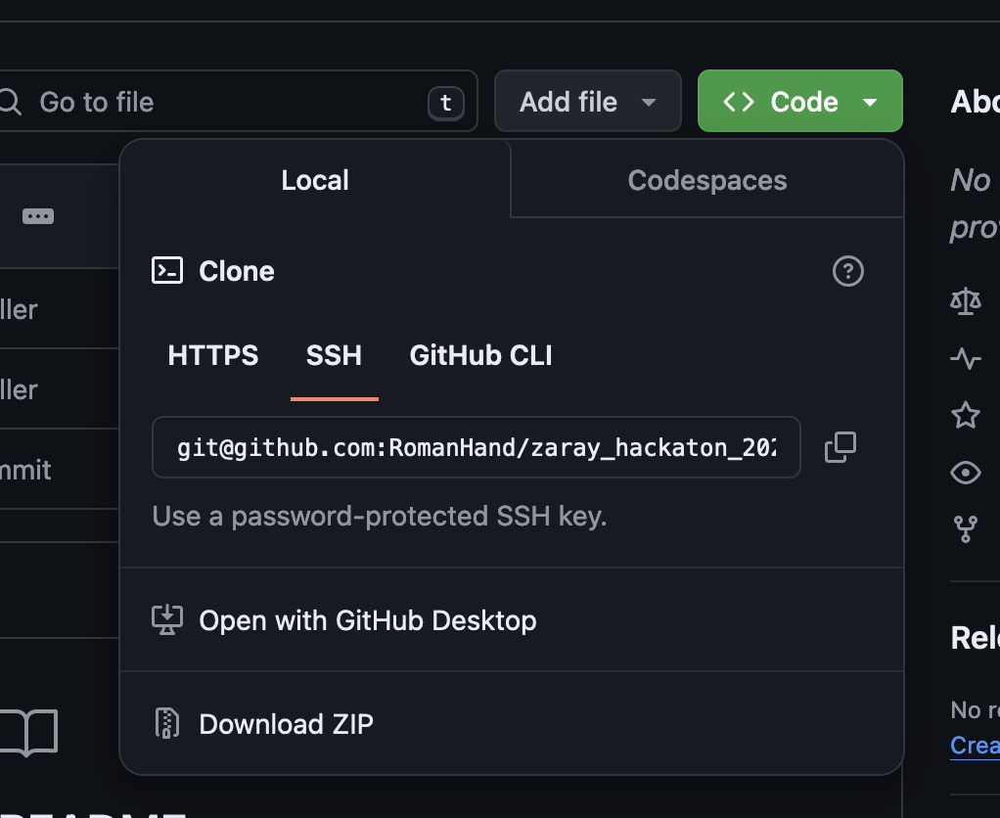

# Программный комплекс Автоматизации выявления технологических нарушений 

## Установка и запуск

### Windows 


## Сборка и компиляция ПО
```
Скачиваем архив ZIP и распаковываем на рабочем столе
```



Необходимое ПО для компиляции:
* компилятор языка GO версии 1.22.3 или выше
* Интерпретатор языка  python версии 3.12 или выше

cборка и установку
```
.\make.bat
```

установка
Скачать последний релиз на GitHub, распаковать ар